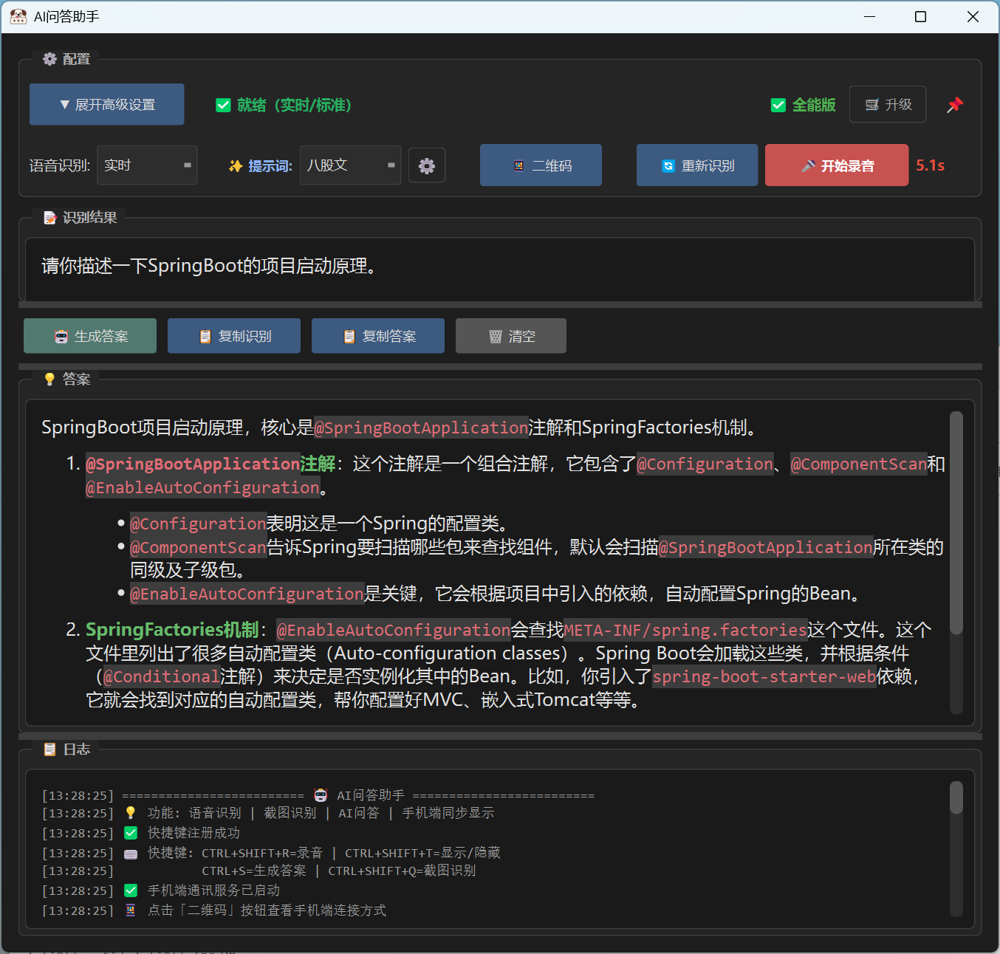
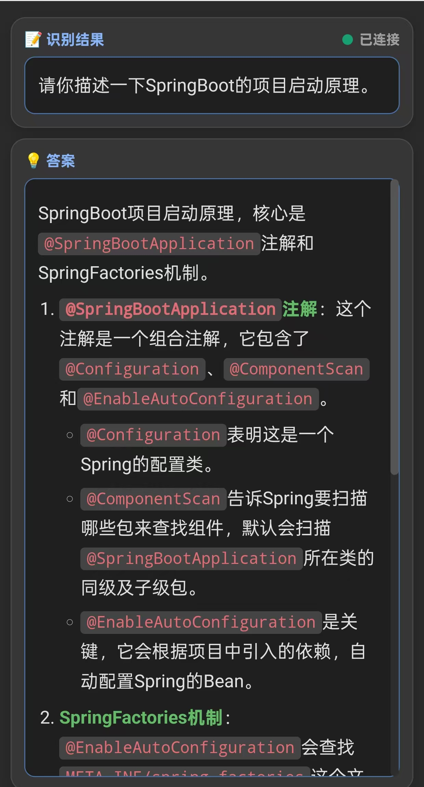
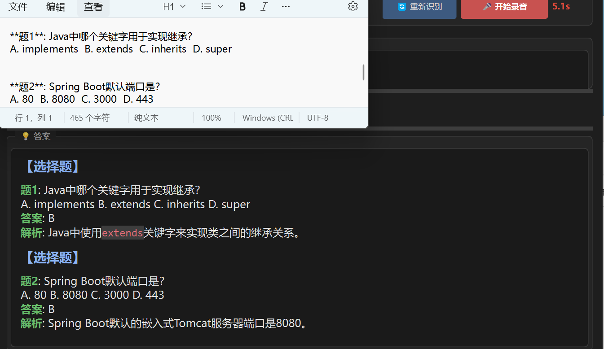
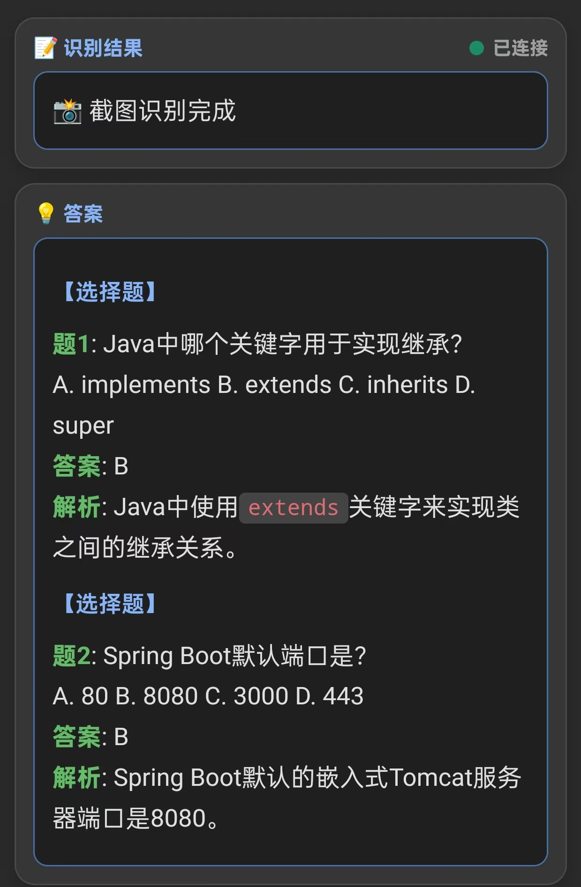

# 🎤 AI问答助手

> 面试场景 + 笔试场景 + AI 问答 | 手机同步 | 全局快捷键

## ✨ 主要功能

- **🎙️ 面试场景**：实时/标准/本地三种模式，支持麦克风和系统音频，后台隐藏运行
- **📸 笔试场景**：全屏或区域截图，AI 自动分析内容，无感操作
- **🤖 AI 问答**：自动生成答案，支持多模板和上下文对话
- **📱 手机同步**：扫码连接，识别结果和答案实时推送到手机，查看答案
- **⌨️ 全局快捷键**：后台运行，一键操作，电脑端隐藏执行

## 🚀 快速开始

1. 下载：[Releases](https://github.com/1815578857/ai-assistant/releases)
2. 运行 `AI问答助手.exe`

## ⌨️ 快捷键（可自定义）

| 快捷键 | 功能 |
|--------|------|
| `Ctrl+Shift+R` | 开始/停止录音 |
| `Ctrl+Shift+Q` | 笔试场景 |
| `Ctrl+Shift+T` | 显示/隐藏窗口 |
| `Ctrl+S` | 生成答案|

## 📱 手机同步

点击 `📱 二维码` → 扫码连接 → 实时同步

## 📷 产品展示

### 面试场景
<table>
  <tr>
    <td></td>
    <td></td>
  </tr>
  <tr>
    <td align="center"><b>电脑端</b> - 面试场景 + AI 问答</td>
    <td align="center"><b>手机端</b> - 实时同步显示</td>
  </tr>
</table>

### 笔试场景
<table>
  <tr>
    <td></td>
    <td></td>
  </tr>
  <tr>
    <td align="center"><b>电脑端</b> - 笔试场景 + AI 解答</td>
    <td align="center"><b>手机端</b> - 答案实时推送</td>
  </tr>
</table>

---

## ❓ 常见问题

- **模型 API 初始化失败**：开启代理 TUN 模式
- **快捷键无效**：以管理员权限运行
- **手机连接失败**：确保同一 WiFi或局域网，检查防火墙

## 📝 更新日志

**v2.5.0** - 自定义快捷键、UI布局优化、AI提示词优化  
**v2.4.0** - 自定义热词/提示词、上下文对话、性能优化  
**v2.3.0** - 实时识别、代码重构  
**v2.1.0** - 笔试场景、手机同步  

---
## 📞 联系方式
如有问题，可联系QQ：1815578857

---

## 📄 许可证

MIT License

---

⭐ **如果这个项目对你有帮助，请给个 Star！**
